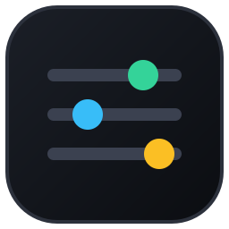
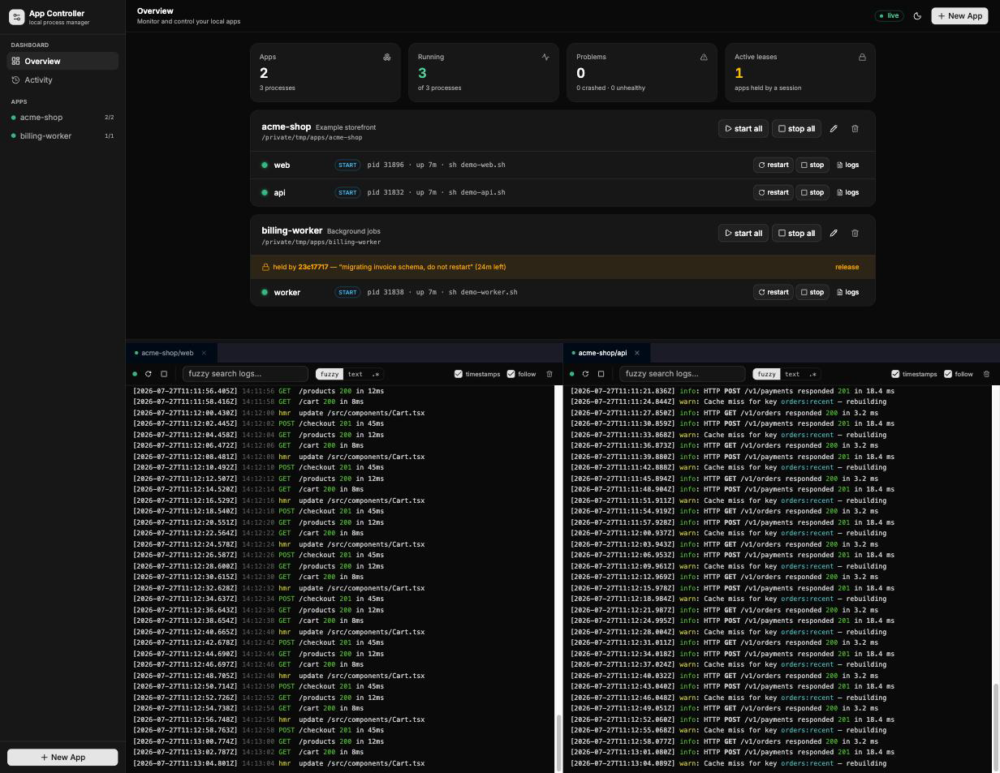
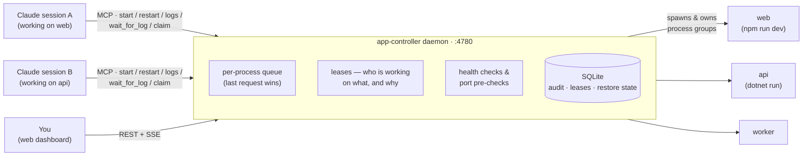

<p align="center"></p>

# mcp-app-controller

Central daemon that owns and manages your local app processes, exposed to Claude Code sessions
via MCP (Streamable HTTP) and to you via a web dashboard. Because every session talks to the
same daemon, multiple concurrent Claude sessions can no longer fight over who "owns" an app —
starts/stops/restarts are coordinated with leases, a per-process operation queue, and a shared
audit trail.



## How it works

Processes live inside one central daemon. Claude Code sessions and the browser are just thin
clients — nobody can "take over" an app, and every action is attributed and coordinated:



A typical multi-session moment: session A restarts `web` with a reason; the daemon takes a
short lease. When session B tries to restart the same app seconds later, it gets a CONFLICT
answer telling it *who* is working on the app and *why* — instead of silently killing A's
process. You always override from the dashboard, and everything lands in the audit trail.

### Build-once (`prepare`) and staggered starts

Apps whose processes share compiled projects (e.g. five `dotnet run` processes all
referencing the same core solution) waste CPU and can race MSBuild when started together.
Two optional app-level settings fix this:

- `prepare: <command>` — run to completion (in the app cwd, same env layering as
  processes) before **every** start/restart operation of the app: whole-app, single
  process, profile start, and boot restore. Concurrent operations share a single run,
  and a success within the last 30s is reused (bursts don't re-build back-to-back).
  Because the build is guaranteed fresh at spawn time, process commands can safely use
  `--no-build` launchers for instant starts. Output is logged as pseudo-process
  `<app>/prepare` (visible via `app_logs`); non-zero exit or timeout
  (`prepareTimeoutMs`, default 10 min) aborts the operation.
- `staggerMs: <n>` — pause between process starts in a multi-process operation, to
  spread the CPU/RAM spikes of heavy dev servers (webpack etc.).

## Run

```bash
npm install
npm --prefix ui install
cp apps.example.yaml apps.yaml   # then define your apps (or use the web UI / MCP)
npm run build        # builds daemon (tsc) + web UI (vite → public/)
npm start            # or: npm run dev (tsx, no build step)
```

The web UI is a React + Vite + Tailwind + shadcn/ui app in `ui/`; `npm run build` (or
`npm run build:ui`) outputs it to `public/`, which the daemon serves. For UI development,
run the daemon plus `npm run dev:ui` (Vite dev server on :5173, proxies `/api` to :4780).

### Log dock

Clicking **logs** on a process opens it as a tab in a persistent, resizable bottom dock
(dockview): tabs stay open until closed, can be dragged onto another pane's left/right/
top/bottom edge to split the view (VS Code-style window management), and each pane has
its own search (fuzzy / plain text / regex modes) and follow toggle. Logs render ANSI
terminal colors (processes are spawned with `FORCE_COLOR=1`); the MCP `app_logs` tool
returns color-stripped text. The dock layout (open tabs, splits, height) is persisted in
localStorage and restored on page load.

- Web UI:       http://127.0.0.1:4780/
- MCP endpoint: http://127.0.0.1:4780/mcp
- Port override: `APPCTRL_PORT=5000 npm start`

Managed processes live inside the daemon — if the daemon stops, it gracefully stops them all.

### Run as a service (recommended)

```bash
scripts/install-launchd.sh     # installs + starts a LaunchAgent (auto-start on login, kept alive)
scripts/uninstall-launchd.sh   # removes it
npm run deploy                 # rebuild + restart the service (apps auto-restore)
npm run restart                # restart the service without rebuilding
```

The agent launches the daemon through your **login shell** so managed apps inherit your full
shell environment (PATH, app config variables, etc.). Re-run the install script
after `npm run build` deploys daemon changes, or after changing your shell env. Daemon output
goes to `data/daemon.log`. Note: `launchctl bootstrap` occasionally fails transiently right
after a bootout — just re-run the script.

### App environment (`envShell`)

Managed apps need your environment variables, but *which shell loads them* is a classic trap:
launchd knows only your **registered** default shell (`chsh`), and zsh/bash don't read their
interactive rc files (`~/.zshrc`) in non-interactive login mode. If your env lives in, say,
fish config while the machine's default shell is zsh, set it explicitly in `apps.yaml`:

```yaml
envShell: /opt/homebrew/bin/fish
```

At startup (and on config reload) the daemon runs `<envShell> -l -c env`, captures everything
that shell's login config exports, and injects it into every managed process — regardless of
what launchd or `chsh` say. Configurable from the dashboard's **Settings** page (which also
shows how many variables were captured), along with crash notifications and profiles. The daemon log prints how many variables were captured. Per-process
`env:` entries in `apps.yaml` still override captured values.

### Health checks

A process definition can declare `healthUrl` (HTTP GET, any response < 500 = healthy) or
`healthPort` (TCP connect on 127.0.0.1). The daemon polls every 5s; the UI shows an amber
pulsing dot + "unhealthy" badge for running-but-unhealthy processes. MCP `start_app` /
`restart_app` default to `wait_ready: true` — they block (max 30s) until the health check
passes and report readiness, so Claude sessions know the app is actually up.

## Register with Claude Code (all sessions)

```bash
claude mcp add --scope user --transport http app-controller http://127.0.0.1:4780/mcp
```

Recommended addition to your global `~/.claude/CLAUDE.md` so sessions actually use it:

> Never start/stop/restart apps directly from the shell. Always use the `app-controller`
> MCP tools (`list_apps`, `start_app`, `restart_app`, `app_logs`, `wait_for_log`, ...).
> At the start of your work, call `identify` with a short stable name describing your task
> (e.g. "checkout-fix") — your leases then survive daemon restarts and reconnects.
> When working on an app for a while, claim it first with `claim_app` and release it with
> `release_app` when done. If you get a CONFLICT response, stop and consider the other
> session's work — only use `force=true` when you are certain (unless the conflict names
> your own identity after a reconnect: re-identify and retry).

## MCP tools

| Tool | Purpose |
|---|---|
| `identify` | Set a stable session name so leases survive restarts/reconnects |
| `list_apps` | All apps, process statuses, pids, modes, cpu/mem, active leases |
| `start_app` / `stop_app` / `restart_app` | Manage an app or a single process (`mode: start\|dev`, requires `reason`) |
| `app_logs` | Last N log lines (stdout+stderr, timestamped) |
| `app_errors` | Only the recent error/warning lines, deduplicated with counts |
| `wait_for_log` | Block until a log line matches a regex (readiness / next error), with timeout + lookback |
| `claim_app` / `release_app` | Hold an app for a longer task so other sessions get warned |
| `define_app` / `remove_app` | Manage app definitions |
| `clear_build_cache` | Run the app's `clean` command (clear build outputs/package caches; next build restores fresh) |
| `start_profile` / `stop_profile` | Start/stop a named group of apps (profiles in apps.yaml) |
| `recent_activity` | Audit trail: who did what, when, why |

### Dependencies & profiles

A process can declare `dependsOn: [api]` — dependencies auto-start first (recursively) and
are awaited until healthy (or running, if no health check) before the dependent starts.
Whole-app starts follow topological order. `profiles:` in apps.yaml names groups of targets
("app" or "app/process") startable/stoppable in one action from the sidebar or MCP.

### Triggers & alarms

`triggers:` in apps.yaml (or the Settings page, or the MCP `define_trigger` tool) watch every
log line with a regex; matches fire **alarms** — shown behind the header bell with a severity
badge, optionally notified (macOS/Slack), throttled per trigger. Clicking an alarm opens the
process's log panel and jumps to the exact matching line (searching rotated files too).
Agents can check `list_alarms` and leave persistent watches with `define_trigger`.

### Environment layers

Per app: `env:` (app-wide), `environments:` (named sets like dev/test/staging/prod) with an
`activeEnvironment`, plus per-process `env:`. Merge order: captured shell env → app-wide →
active set → process. All editable from the App View's Environment card; switch sets from the
UI or the MCP `set_environment` tool (restart applies them).

### Notifications & log rotation

Crashes trigger a macOS notification (and an optional Slack webhook via
`notify.slackWebhook` in apps.yaml), throttled per process. Log files rotate at
`APPCTRL_LOG_MAX_MB` (default 20 MB), keeping two previous generations. Logs are also
exposed as MCP resources (`logs://<app>/<process>`).

### Boot restore

The daemon tracks the desired state of every process (SQLite `restore_state`). On startup it
automatically restarts whatever was running before it went down — including after a hard kill:
if the previous daemon died without cleanup (SIGKILL), orphaned child processes still holding
their ports are detected by recorded pid, killed by process group, and started fresh. Disable
with `APPCTRL_NO_RESTORE=1`.

### Port pre-check & crash summaries

A process can declare the TCP ports it binds (`ports: [4070, 4470]`; health ports/URLs are
included automatically). Before starting, the daemon verifies they are free: if the holder
is an orphan of a previous run of the same process it is reclaimed automatically, otherwise
the start fails fast with the holder's pid and command. If the holder was started *outside*
the controller (e.g. manually in a terminal), pass `takeover: true` (MCP) or confirm the
takeover prompt (UI) to stop it and run the process under controller management instead —
the takeover is recorded in the audit trail. When a process crashes, the daemon
extracts the most plausible error line from the log tail and surfaces it everywhere —
`list_apps`, start/restart responses, and the UI process row.

### Operation queue

All mutating operations (start/stop/restart) are serialized **per process** — no interleaved
stop/start sequences when requests arrive concurrently. While an operation runs, at most one
request waits per process; a newer request replaces the waiting one, and the replaced caller
gets an explicit `superseded` response (MCP: "NOT EXECUTED: superseded by a newer queued
request"). Last request wins.

## Conflict model

- Every mutating action records a 5-minute lease for the calling session and requires a `reason`.
- `claim_app` takes a longer lease (default 30 min) for multi-step work.
- If another session holds an active lease, mutating calls return a **CONFLICT** message
  (who, why, how long ago) instead of executing. The session can retry with `force=true`.
- The web UI (you) always overrides leases; UI actions are logged as `ui` in the audit trail.

## Shared repo configs (`include:`)

`apps.yaml` can pull app definitions from config files that live inside your repos and are
shared with the whole team via git:

```yaml
include:
  - ~/workspace/sources/monosign/core/fastBuild/app-controller.yaml
```

- **Opt-in, never invasive** — you only get the shared apps if you add the include line, and
  an app you define in your own `apps.yaml` always wins over a same-named included app.
  Editing an included app (define_app, env editor) forks a personal copy into `apps.yaml`.
- **Per-developer overrides** — for each included `X.yaml`, a sibling `X.local.yaml`
  (gitignored) is deep-merged on top: apps matched by name, processes by name, env maps
  merged per key. Machine-specific bits (e.g. `fnm use 20 && yarn vue`) go there.
- **Machine-independent paths** — a relative `cwd` in an included file resolves against
  that file's directory, so committed configs work in any clone location.
- **Hot-reload** — include files and their `.local.yaml` siblings are watched; saving any
  of them reloads the config. Missing include files are skipped with a warning.
- `list_apps` and the UI show where a shared definition comes from.

### `clean` command (clear build cache)

An app may define `clean:` (plus optional `cleanTimeoutMs`), a one-shot command run via the
`clear_build_cache` MCP tool or the *clean* button on the app card — e.g. delete `obj/`+`bin/`
and clear the package cache so the NEXT build restores fresh packages. It runs in the app
cwd with the usual env layering, logs under `<app>/clean`, and invalidates the prepare reuse
window. Running processes are not touched — restart afterwards to rebuild.

## Files

- `apps.yaml` — your app definitions (hand-editable, hot-reloaded; gitignored — see `apps.example.yaml`)
- `data/controller.db` — audit log, leases, restore state (SQLite; gitignored)
- `data/logs/<app>__<process>.log` — per-process logs (gitignored)

## License

MIT
