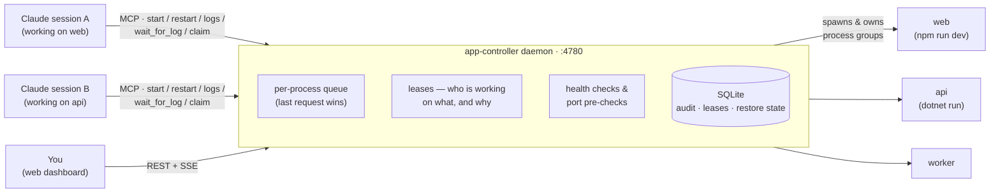

# mcp-app-controller

Central daemon that owns and manages your local app processes, exposed to Claude Code sessions
via MCP (Streamable HTTP) and to you via a web dashboard. Because every session talks to the
same daemon, multiple concurrent Claude sessions can no longer fight over who "owns" an app —
starts/stops/restarts are coordinated with leases, a per-process operation queue, and a shared
audit trail.


## How it works

Processes live inside one central daemon. Claude Code sessions and the browser are just thin
clients — nobody can "take over" an app, and every action is attributed and coordinated:



A typical multi-session moment: session A restarts `web` with a reason; the daemon takes a
short lease. When session B tries to restart the same app seconds later, it gets a CONFLICT
answer telling it *who* is working on the app and *why* — instead of silently killing A's
process. You always override from the dashboard, and everything lands in the audit trail.

## Run

```bash
npm install
npm --prefix ui install
cp apps.example.yaml apps.yaml   # then define your apps (or use the web UI / MCP)
npm run build        # builds daemon (tsc) + web UI (vite → public/)
npm start            # or: npm run dev (tsx, no build step)
```

The web UI is a React + Vite + Tailwind + shadcn/ui app in `ui/`; `npm run build` (or
`npm run build:ui`) outputs it to `public/`, which the daemon serves. For UI development,
run the daemon plus `npm run dev:ui` (Vite dev server on :5173, proxies `/api` to :4780).

### Log dock

Clicking **logs** on a process opens it as a tab in a persistent, resizable bottom dock
(dockview): tabs stay open until closed, can be dragged onto another pane's left/right/
top/bottom edge to split the view (VS Code-style window management), and each pane has
its own search (fuzzy / plain text / regex modes) and follow toggle. Logs render ANSI
terminal colors (processes are spawned with `FORCE_COLOR=1`); the MCP `app_logs` tool
returns color-stripped text. The dock layout (open tabs, splits, height) is persisted in
localStorage and restored on page load.

- Web UI:       http://127.0.0.1:4780/
- MCP endpoint: http://127.0.0.1:4780/mcp
- Port override: `APPCTRL_PORT=5000 npm start`

Managed processes live inside the daemon — if the daemon stops, it gracefully stops them all.

### Run as a service (recommended)

```bash
scripts/install-launchd.sh     # installs + starts a LaunchAgent (auto-start on login, kept alive)
scripts/uninstall-launchd.sh   # removes it
```

The agent launches the daemon through your **login shell** so managed apps inherit your full
shell environment (PATH, app config variables, etc.). Re-run the install script
after `npm run build` deploys daemon changes, or after changing your shell env. Daemon output
goes to `data/daemon.log`. Note: `launchctl bootstrap` occasionally fails transiently right
after a bootout — just re-run the script.

### App environment (`envShell`)

Managed apps need your environment variables, but *which shell loads them* is a classic trap:
launchd knows only your **registered** default shell (`chsh`), and zsh/bash don't read their
interactive rc files (`~/.zshrc`) in non-interactive login mode. If your env lives in, say,
fish config while the machine's default shell is zsh, set it explicitly in `apps.yaml`:

```yaml
envShell: /opt/homebrew/bin/fish
```

At startup (and on config reload) the daemon runs `<envShell> -l -c env`, captures everything
that shell's login config exports, and injects it into every managed process — regardless of
what launchd or `chsh` say. The daemon log prints how many variables were captured. Per-process
`env:` entries in `apps.yaml` still override captured values.

### Health checks

A process definition can declare `healthUrl` (HTTP GET, any response < 500 = healthy) or
`healthPort` (TCP connect on 127.0.0.1). The daemon polls every 5s; the UI shows an amber
pulsing dot + "unhealthy" badge for running-but-unhealthy processes. MCP `start_app` /
`restart_app` default to `wait_ready: true` — they block (max 30s) until the health check
passes and report readiness, so Claude sessions know the app is actually up.

## Register with Claude Code (all sessions)

```bash
claude mcp add --scope user --transport http app-controller http://127.0.0.1:4780/mcp
```

Recommended addition to your global `~/.claude/CLAUDE.md` so sessions actually use it:

> Never start/stop/restart apps directly from the shell. Always use the `app-controller`
> MCP tools (`list_apps`, `start_app`, `restart_app`, `app_logs`, `wait_for_log`, ...).
> When working on an app for a while, claim it first with `claim_app` and release it with
> `release_app` when done. If you get a CONFLICT response, stop and consider the other
> session's work — only use `force=true` when you are certain.

## MCP tools

| Tool | Purpose |
|---|---|
| `list_apps` | All apps, process statuses, pids, modes, active leases |
| `start_app` / `stop_app` / `restart_app` | Manage an app or a single process (`mode: start\|dev`, requires `reason`) |
| `app_logs` | Last N log lines (stdout+stderr, timestamped) |
| `wait_for_log` | Block until a log line matches a regex (readiness / next error), with timeout + lookback |
| `claim_app` / `release_app` | Hold an app for a longer task so other sessions get warned |
| `define_app` / `remove_app` | Manage app definitions |
| `recent_activity` | Audit trail: who did what, when, why |

### Boot restore

The daemon tracks the desired state of every process (SQLite `restore_state`). On startup it
automatically restarts whatever was running before it went down — including after a hard kill:
if the previous daemon died without cleanup (SIGKILL), orphaned child processes still holding
their ports are detected by recorded pid, killed by process group, and started fresh. Disable
with `APPCTRL_NO_RESTORE=1`.

### Port pre-check & crash summaries

A process can declare the TCP ports it binds (`ports: [4070, 4470]`; health ports/URLs are
included automatically). Before starting, the daemon verifies they are free: if the holder
is an orphan of a previous run of the same process it is reclaimed automatically, otherwise
the start fails fast with the holder's pid and command. When a process crashes, the daemon
extracts the most plausible error line from the log tail and surfaces it everywhere —
`list_apps`, start/restart responses, and the UI process row.

### Operation queue

All mutating operations (start/stop/restart) are serialized **per process** — no interleaved
stop/start sequences when requests arrive concurrently. While an operation runs, at most one
request waits per process; a newer request replaces the waiting one, and the replaced caller
gets an explicit `superseded` response (MCP: "NOT EXECUTED: superseded by a newer queued
request"). Last request wins.

## Conflict model

- Every mutating action records a 5-minute lease for the calling session and requires a `reason`.
- `claim_app` takes a longer lease (default 30 min) for multi-step work.
- If another session holds an active lease, mutating calls return a **CONFLICT** message
  (who, why, how long ago) instead of executing. The session can retry with `force=true`.
- The web UI (you) always overrides leases; UI actions are logged as `ui` in the audit trail.

## Files

- `apps.yaml` — your app definitions (hand-editable, hot-reloaded; gitignored — see `apps.example.yaml`)
- `data/controller.db` — audit log, leases, restore state (SQLite; gitignored)
- `data/logs/<app>__<process>.log` — per-process logs (gitignored)

## License

MIT
